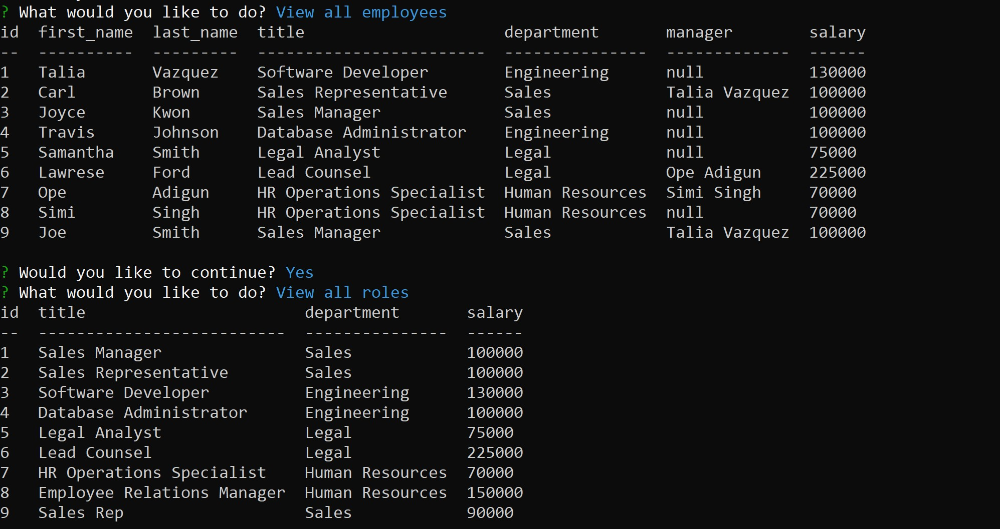

# Unit 12 MySQL Homework: Employee Tracker

This is a command line interface **C**ontent **M**anagement **S**ystems application. It is a solution for managing a company's employees and is built with node, inquirer, and MySQL.


## User Story:

```
As a business owner
I want to be able to view and manage the departments, roles, and employees in my company
So that I can organize and plan my business
```

## Technology Used

* [MySQL](https://www.npmjs.com/package/mysql) NPM package for connecting to MySQL database and perform queries.

* [InquirerJs](https://www.npmjs.com/package/inquirer/v/0.2.3) NPM package for interacting with the user via the command-line.

* [console.table](https://www.npmjs.com/package/console.table) NPM package for printing MySQL rows to the console. 

## Requirements

* Functional application.

* GitHub repository with a unique name and a README describing the project.

* The command-line application should allow users to:

  * Add departments, roles, employees

  * View departments, roles, employees

  * Update employee roles

## Installation and Usage

To install the application, run `npm install` in the root directory to install the required dependencies. For this application to run, `Nodejs` must be installed. [Click here](https://nodejs.org/en/) to download `Nodejs` if it not already installed on your machine.

To use the application, run `npm start` and follow the prompts on the console. 

## Schema 

 

## Demo


### CLI Output



## Contact
[Rachael Adu](https://github.com/rad-a)


